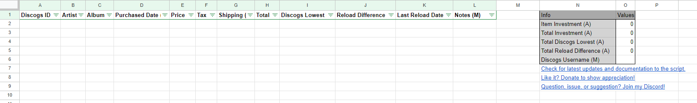
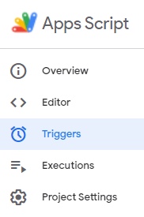
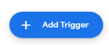
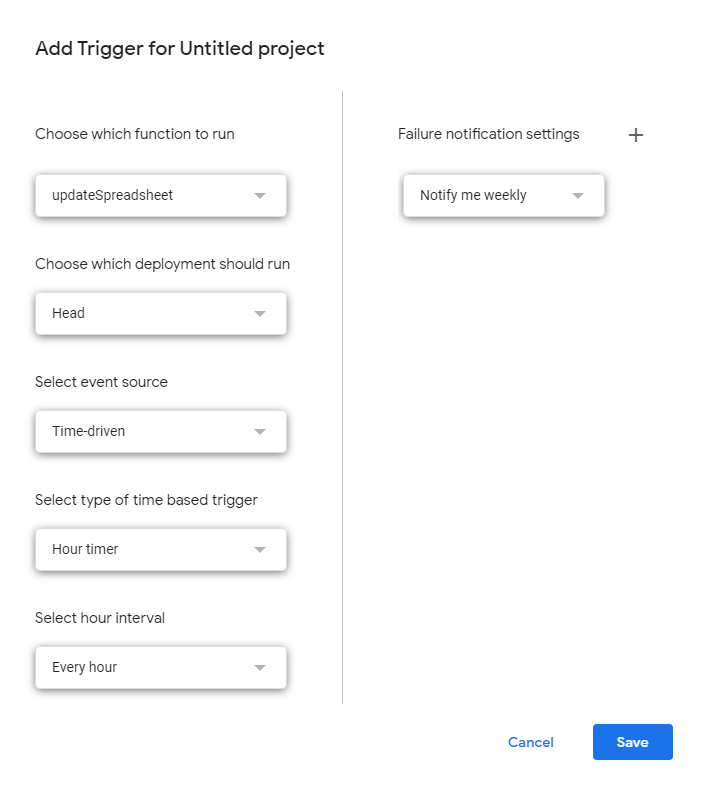

# Discogs Vinyl Collection Tracker for Google Sheets
A Google Script project for Google Sheets that can be used to keep an inventory of your vinyl collection with Discogs integration.

# Main Features
- Automatically builds, maintains, and formats the spreadsheet's structure.
- Automatically imports your collection data from Discogs.
- Allows you to input and save your purchase stats, such as date of purchase, price, tax, shipping, etc.
- Automatically gets the lowest listed price on Discogs for each item.
- Automatically updates cell colors to visually indicate profit/loss percentages.
- Automatically calculates collection's total cost and minimum value (using lowest listed prices).

# Outline of Script Steps
1. **Normalizes Spreadsheet**: Maintains and corrects the structure of the spreadsheet to how it was designed in the code. See [Explanation of Spreadsheet Structure](#explanation-of-spreadsheet-structure) to learn about the structure.
2. **Loads Discogs Collection**: Insert new rows for each item in your Discogs collection that is not already in the spreadsheet. See [Automatic Discogs Import](#automatic-discogs-import) for instructions to start automatically importing your Discogs collection.
3. **Loads Discogs Data**: Updates each item with current data from Discogs. See [Loading Discogs Data](#loading-discogs-data) for what data is taken from Discogs and how it is used to update the spreadsheet.

# Getting Started
1. Go to Google Sheets and create a new blank sheet.

2. In the menu bar, navigate to Extensions -> Apps Script. A new window should open with a text editor for Apps Script.

3. Copy the code from the vinyl.js file in this GitHub repository and paste it into the Apps Script text editor, replacing any code that is already there. Then hit the save button at the top of the text editor.

4. After you save, a dropdown should be available next to the Debug button. Make sure this dropdown has the "updateSpreadsheet" option selected.

5. Click Run. You will be prompted to review the necessary permissions this script needs in order to run. Review and approval are only needed on the first run. Choose the profile that the sheet belongs to if presented with multiple profiles.

6. When you reach a screen with the text "Google hasn't verified this app," click the small "Advanced" button and then click "Go to Project (unsafe)". Since you are running this code yourself, it is not verified by Google, thus triggering the warning.

 

7. A popup saying "Project wants to access your Google Account." Click "Allow." Permissions are needed to:
   - Let the script have full control over the spreadsheet so it can make changes automatically.
   - Let the script make external web requests to the Discogs API to import your collection and pricing data.
   - Let the script display errors to you when something goes wrong.
   - Let the script build a custom menu to run the script easier.

8. If too much time has passed, you may need to click Run again in Apps Script. Once the script is complete, you can go back to the spreadsheet to see the pre-defined structure that the script has built.

9. Refresh the spreadsheet page. Doing so will close the Apps Script window and a few seconds later a "Vinyl Tracker" menu will appear at the top of the spreadsheet. From here, you will have the ability to run the entire script or select parts of it without having to go back to Apps Script. **Note**: This custom menu always takes a few seconds to load after each time the page is refreshed.

10. You are now ready to start using the script! You can learn how to add your collection to the spreadsheet using the [Adding To Your Collection](#adding-to-your-collection) section below. You can also continue reading other sections to learn how the script works and to use it most effectively. Visit back here for future updates to the script and documentation. If you would like to add a few more advanced features to the script that could not be added automatically, see the [Advanced Setup](#advanced-setup) section for more information.

# Updating The Script
You may want to periodically update the script to adopt new features or bug fixes. While it is not currently possible to get updates automatically, you can optionally update your script manually to the latest version for new features. Official updates to the script can only be found in this GitHub repository. Since there is no guarantee of compatibility between versions it is highly recommended that you follow the instructions in the [Getting Started](#getting-started) section again and create a new spreadsheet from scratch, which you would build with the latest version of the script, and then manually migrate your data over accordingly. The preservation of your data is solely your responsibility. You are also responsible for maintaining any modifications you make to the script, if any.

# Explanation of Spreadsheet Structure
The script automatically builds and maintains a structure for itself in the spreadsheet. This structure is coded into the script, therefore any changes you make to the structure within the spreadsheet will be reverted back to the coded structure. Permanent changes to the structure can be made by altering the script, however, this is done at your own risk.

## Vinyl Tracker Menu
The script automatically adds a custom menu above the spreadsheet called "Vinyl Tracker". This menu always takes a few seconds to appear after opening or refreshing the spreadsheet. This menu allows you to run the entire script or only certain pieces of it. Below is a description of what each option does:
- **Run Script**: This will run the entire script. Please see [Outline of Script Steps](#outline-of-script-steps) for additional information on what the entire script does.
- **Reset Structure**: This will only reset the spreadsheet's structure back to what is coded. See below for what that structure is.
- **Load New Discogs Items**: This will only add new rows with the Discogs IDs of items in your Discogs collection that are not already in the spreadsheet.
- **Load Discogs Data**: This will update all rows with a Discogs ID and Last Reload Date not equal to today's date with latest data from Discogs. See [Loading Discogs Data](#loading-discogs-data) for more information.

## Collection
The script will build an area on the left side where information about your vinyl collection is stored. Each column is marked to signify that they are **(A)utomatically** or **(M)anually** populated. Fields marked with an **(A)** are automatically fetched or calculated once a Discogs ID is added to the row. Fields marked with an **(M)** are fields that represent information that only you would know, requiring you to manually populate if you wish. Below is a description of what each column represents:
- **Discogs ID**: This is the unique number that identifies the release in Discogs. This can be found manually in the URL like so: discogs.com/[Discogs ID]-Artist-Album
- **Artist**: This is the name of the artist. It can be manually populated to keep track of purchases not yet in your Discogs collection. Once a Discogs ID is added to the row, it is overwritten with the artist's name as shown in Discogs.
- **Album**: This is the name of the album. It can be manually populated to keep track of purchases not yet in your Discogs collection. Once a Discogs ID is added to the row, it is overwritten with the album's name as shown in Discogs.
- **Purchased Date**: This is the date the item was purchased. This is only for your own records and is not used by the script for any reason.
- **Price**: This is where you manually put the price you paid for the item, pre-tax/shipping. If you do not wish to store the costs in such detail, you can just put the total cost here instead.
- **Tax**: This is where you manually put the tax cost for the item. This field can be blank if you do not wish to store your costs in detail.
- **Shipping**: This is where you manually put the shipping cost for the item. This field can be blank if you do not wish to store your costs in detail.
- **Total**: This is automatically calculated by the script and is equal to the sum of the Price, Tax, and Shipping costs of the item. This value is used to determine the color of the Discogs Lowest cell.
- **Discogs Lowest**: This is automatically populated with the lowest listed price for the item on Discogs. This is not to be mistaken with the last sold price, which is data that cannot be accessed using the API. The color of this cell is determined by the profit/loss percentage calculated by comparing the Total and Discogs Lowest values, reaching the caps at +/- 10%. If there is no listing for the item, it is set to $0.00 and white.
- **Reload Difference**: This is automatically populated with the amount that the price has changed since the last time the script updated the row.
- **Last Reload Date**: This is the last time the script updated the row. The script uses this date to determine if it has already updated the row for the day.
- **Notes**: This is where notes about the item can be manually entered. This is only for your own records and is not used by the script for any reason.

## Info Section
The script will build an info section to the right of the [Collection](#collection). This section will show a summary of your collection, as well as expose certain settings that you can configure. Below is a description of what each row represents:
### Collection Summary
- **Item Investment**: This is the sum of all values in the Price column. If prices are stored in detail, then this can represent the total amount of money spent on items before tax and shipping, otherwise, this value will be equal to Total Investment.
- **Total Investment**: This is the sum of all values in the Total column. This can represent the total amount of money spent on items, including tax and shipping.
- **Total Discogs Lowest**: This is the sum of all values in the Discogs Lowest column. This represents the minimum amount of money your collection is currently selling for. This should not be interpreted as collection value, since it is not calculated based on any sold prices.
- **Total Reload Difference**: This is the sum of all values in the Reload Difference column. It shows the total amount your collection's value has shifted since the last time the script updated the rows.
### Settings
- **Discogs Username**: This is where you would put your Discogs username so the script can manually import your collection for you.
- **Profit/Loss Threshold %**: This is the percentage used as the upper and lower bound when calculating the Discogs Lowest cell's color.
	- **Example**: The default value, 10%, means that profits and losses of 10% or more will appear as the full Profit Color and Loss Color, respectively. A profit of 4% would show a blended color of 40% Profit Color and 60% Break-Even Color. A loss of 15% would show the full Loss Color without blending.
- **Loss Color**: This is the color that the Discogs Lowest cell is set to when the loss equals or exceeds the Loss Threshold %. Update this cell's color to change the color the script will use.
- **Break-Even Color**: This is the color that the Discogs Lowest cell is set to when there is no profit or loss, meaning that it is equal to the total paid. Update this cell's color to change the color the script will use.
- **Profit Color**: This is the color that the Discogs Lowest cell is set to when the profit equals or exceeds the Profit Threshold %. Update this cell's color to change the color the script will use.
- **Not Listed Color**: This is the color that the Discogs Lowest cell is set to when the value is set to 0.00, meaning that there is no lowest listed price. Update this cell's color to change the color the script will use.
- **Missing ID Color**: This is the color that the row is set to when there is no Discogs ID present. Update this cell's color to change the color the script will use.

# Adding To Your Collection
There are currently two methods you can use to import your collection, automatically or manually. There will always be a manual input needed for cost information, but you can leverage automation to fill in a lot of information from Discogs.

## Automatic Discogs Import
The easiest way to put your collection into the spreadsheet is to let the script import your Discogs collection automatically. After satisfying the prerequisite below, this can be done by adding your username to the Discogs Username row of the [Settings](#settings) and then running the script.

### Prerequisite
A prerequisite for this to work properly is to set your Discogs collection to be public so the script can fetch it. The option to make your collection public can be found in the [Discogs privacy settings](https://www.discogs.com/settings/privacy) when signed in. If you do not wish to expose your collection to the public or do not have a collection in Discogs to import, you may use the next section's steps for [Manual Import](#manual-import).

### What Happens
When a username has been added to the spreadsheet, the script will automatically add the Discogs IDs for all the items in your Discogs collection. The script will only add new Discogs IDs for items not already in the spreadsheet. The script never removes items when they are no longer in your Discogs collection. Therefore, items can only be deleted from the spreadsheet manually.

**NOTE**: The script cannot identify items you have entered manually without a Discogs ID, therefore all new items are added to the bottom. You will have to move the Discogs ID of the new row into the row that you manually entered. Then delete the extra row created by the script. The next time the script runs, it will clean up your manually entered row with Discogs data relating to the ID. See [Loading Discogs Data](#loading-discogs-data) for more information on what this means.

## Manual Import
You can add items to the spreadsheet with or without a Discogs ID manually. The Discogs ID is the number that can be found in the URL of a release, like so: discogs.com/[Discogs ID]-Artist-Album. When an item is added without a Discogs ID, the script will highlight the row the next time it runs to indicate it's missing. Once a Discogs ID is added, the script will remove the highlight the next time it runs. This allows you to add rows for items that you have ordered, but have not yet added to your collection in Discogs.

Columns that are marked with a (M) always require manual input. Please see [Collection](#collection) for an explanation of each column.

# Loading Discogs Data
Every time the script runs, each item that contains a Discogs ID and a Last Reload Date not equal to today will update all fields that are marked with an (A). This action overwrites any data that was previously populated.

**:bangbang: IMPORTANT NOTE :bangbang:**: Due to limitations on how many times you can get data from Discogs API, in combination with Google Apps Script's strict 6-minute timer (unless you run this from a Google Workspace account), the script can only update approximately 135 items per run. Once your collection exceeds this size, the script will have to be run more than once to update all rows. See [Script Scheduling](#script-scheduling) to get the script to keep retrying on an interval until all rows are updated. 

The following data is reloaded from Discogs in the following way:
- **Artist**: Populated using the first name mentioned for the release in Discogs, which is usually the main artist/contributor. Artists that have the same name as other artists are denoted with a number in Discogs, but this number is trimmed off when added to the spreadsheet.
- **Album**: Populated with the album name displayed on the release page.
- **Discogs Lowest**: Populates with the lowest listed price on Discogs. This is not to be mistaken with the last sold price, which is data that cannot be accessed using the API. If nothing is listed, then the value is set to $0.00.
- **Reload Difference**: Populates with the change in Discogs Lowest amount since the last time the script updated the row.

# Advanced Setup
There are a few features you may add yourself using the instructions below. These are mostly quality-of-life improvements that have not or cannot be integrated into the script itself.

## Script Scheduling
If you would like to schedule the script to run on an interval, you can do so by following the instructions below. This is useful if you want to have the data in your spreadsheet to be up to date. It is also extremely useful if the size of your collection exceeds the limit of a single run (approximately 135 items). To enable scheduling:
1. Open Extension -> Apps Script from your spreadsheet.

3. Click the clock icon, which represents Triggers.

5. Click Add Trigger.

7. You may copy the settings in the picture below to set up a trigger that will run the script approximately every hour, which should be able to update approximately 3,000 items per day. You may customize the interval to your individual needs. Unfortunately, it is also required to get an error report sent to your email on an interval as well, errors are inevitable after your collection reaches approximately 135 items. Setting it to notify you weekly reduces spam, and setting up a deletion rule in your email when it first shows up eliminates it entirely.

9. Then click Save. You should see a new trigger listed. Now wait for the interval you configured to pass to verify that the trigger is working. Once confirmed, your spreadsheet will now update automatically on an interval!

**NOTE**: The script uses the Last Reload Date to determine if the row should be updated, which prevents the row from being updated more than once per day.

# Frequently Asked Questions
How does the script get updated?
- Updates to the script will be posted in this repository. Since the setup of this script is run manually as a copy in Apps Script, it does not and cannot have any ties to GitHub. In order to get and apply updates to the script, you will have to come back here to get the latest updates yourself. Updating is not required, but new features may be available that you may find useful. See [Updating The Script](#updating-the-script) for more information on how to update.

Why does the script keep reverting my structural changes to the spreadsheet?
- The script is hard-coded to maintain a certain structure so it knows where to put information properly labeled. Changes to the structure, such as adding or removing columns, can be done by altering the script itself, however, changes are made at your own risk and should only be done if you know how to code.

Can my data be sorted?
- Yes! In fact, the script does not put the data into the spreadsheet in any particular order, so it is recommended that you sort your data often by using the filters available on the column headers. This is because the script is unable to detect how you have your data filtered/sorted, so instead of forcing its own filter upon you while updating, it will add new items to the bottom of the spreadsheet. Once re-sorted, these new items will fall into their correct places.

Can I run the script without going to Apps Script?
- Yes! A custom menu called "Vinyl Tracker" loads into the spreadsheet a few seconds after each time the page is refreshed. Using this custom menu, you can run the script and select parts of it at any time.

Why doesn't my collection import automatically?
- Either your collection in Discogs is set to private, your collection is empty, all items in your collection have already been added, or you have input an invalid username.

Why do some of my items have the Discogs Lowest set to $0.00?
- This happens when nothing is listed, therefore there is nothing to show. This can also happen if you manually entered an invalid Discogs ID.

How do I change the color settings back to their default colors?
- If you wish to revert to any of the color settings back to the defaults set in the code, simply remove the text from the cell. When the script runs again, it will replace the cell's color with the default and write "default" into the cell.

# Feature Request List
These are features that have either been thought of or requested. They are considered, but not guaranteed, to be added in the future.
- Ability to switch currency. Currently only outputs USD.
- Ability to switch timezone for Last Reload Date. Currently only outputs in PST.
- Ability to import using Discogs export .csv file.
- Change the timing mechanism to use the rate-limiting response headers from Discogs to prevent too many request errors.
- Get the script Google-certified as an add-on so users can get and update the script via Google Marketplace instead.
- Build a standalone desktop app that is separate from Google entirely, but would allow authentication to Discogs and grant more benefits from Discogs API.
     - This would allow importing of user lists.
- See if automatic fields can be set to protect so the user doesn't touch them since their changes would be irrelevant.
- Set automatic columns to colors that represent that they are not editable.
- Add a feature to send email reports
- Track the number of items in Discogs collection to handle duplicates
- Error handling so script does not stop on failed call
- Add the ordered date with colors for how late it is.
- Add a way to tell if there have been updates to the script.
- Make release IDs into hyperlinks back to Discogs
