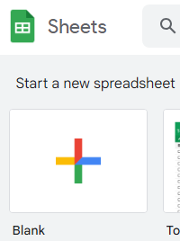
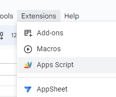
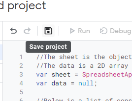
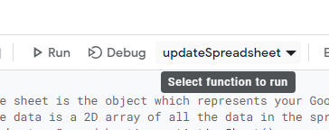
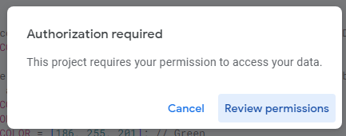
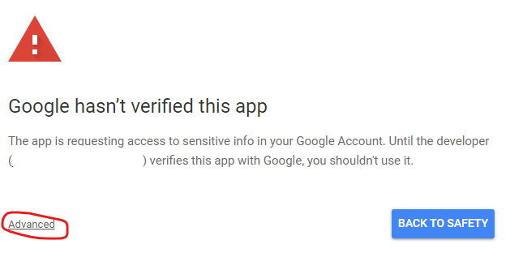
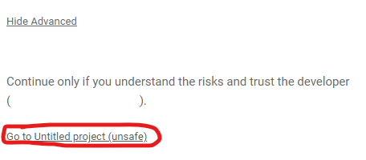
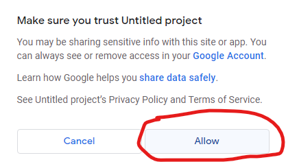
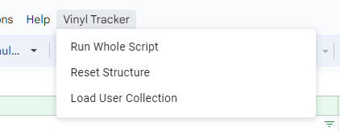

# Discogs Vinyl Collection Tracker for Google Sheets
A Google Script project for Google Sheets that can be used to keep an inventory of your vinyl collection with Discogs integration.

# Main Features
- Automatically builds, maintains, and formats the spreadsheet's structure.
- Automatically imports user's collection data from Discogs.
- Allows users to input and save their purchase stats, such as date of purchase, price, tax, shipping, etc.
- Automatically gets the lowest listed price on Discogs for each item.
- Automatically updates cell colors to visually indicate profit/loss percentages.
- Automatically calculates collection's total cost and minimum value (using lowest listed prices).

# Outline of Script Steps
1. **Normalizes Spreadsheet**: Maintains and corrects the structure of the spreadsheet to how it was designed in the code. See [Explanation of Spreadsheet Structure](#explanation-of-spreadsheet-structure) to learn about the structure. See [Customizing Structure](#customizing-structure) for technical instructions to make the spreadsheet fit your needs.
2. **Loads Discogs Collection**: Inserts new rows for each item in the user's Discogs collection that is not already in the spreadsheet. See [Automatic Discogs Import](#automatic-discogs-import) for instructions to start automatically importing your Discogs collection.
3. **Loads Discogs Data**: Updates each item with current data from Discogs. See [Loading Discogs Data](#loading-discogs-data) for what data is taken from Discogs and how it is used to update the spreadsheet.

# Getting Started
1. Go to Google Sheets and create a new blank sheet.

3. In the menu bar, navigate to Extensions -> Apps Script. A new window should open with a text editor for Apps Script.

4. Copy the code from the vinyl.js file in this GitHub repository and paste it into the Apps Script text editor, replacing any code that is already there. Then hit the save button at the top of the text editor.

5. After you save, a dropdown should be available next to the Debug button. Make sure this dropdown has the "updateSpreadsheet" option selected.

6. Click Run. You will be prompted to review the necessary permissions this script needs in order to run. Review and approval are only needed on the first run. Choose the profile that the sheet belongs to if presented with multiple profiles.

7. When you reach a screen with the text "Google hasn't verified this app," click the small "Advanced" button and then click "Go to Project (unsafe)". Since you are running this code yourself, it is not verified by Google, thus triggering the warning.

 

8. A popup saying "Project wants to access your Google Account." Click "Allow." Permissions are needed to:
   - Let the script have full control over the spreadsheet so it can make changes automatically.
   - Let the script make external web requests to the Discogs API to import user and pricing data.
   - Let the script display errors to you when something goes wrong.
   - Let the script build a custom menu to run the script easier.

9. If too much time has passed, you may need to click Run again in Apps Script. Once the script is complete, you can go back to the spreadsheet to see the pre-defined structure that the script has built.

10. Refresh the page. A few seconds after refreshing a "Vinyl Tracker" menu will appear at the top of the spreadsheet. From here, you will have the option to run the entire script or select parts of it without having to go back to Apps Script. You may now close the Apps Script window. **Note**: This custom menu always takes a few seconds to load after each time the page is refreshed.

11. You are now ready to start using the script! You can learn how to add your collection to the spreadsheet using the [Adding To Your Collection](#adding-to-your-collection) section below. You can also continue reading other sections to learn how the script works and to use it most effectively. Visit back here for future updates to the script and documentation. If you would like to add a few more advanced features to the script that could not be added automatically, see the [Advanced Setup](#advanced-setup) section for more information.

# Updating The Script
You may want to periodically update the script to adopt new features or bug fixes. While it is not currently possible to get updates automatically, you can optionally update your script manually to the latest version for new features. Official updates to the script can only be found in this GitHub repository. Since there is no guarantee of compatibility between versions it is highly recommended that you follow the instructions in the [Getting Started](#getting-started) section again and create a new spreadsheet from scratch, which you would build with the latest version of the script, and then manually migrate your data over accordingly. The preservation of your data is solely your responsibility. You are also responsible for maintaining any modifications you make to the script, if any.

# Explanation of Spreadsheet Structure
The script automatically builds and maintains a structure for itself in the spreadsheet. This structure is coded into the script, therefore any changes you make to the structure within the spreadsheet will be reverted back to the coded structure. If you would like to make changes to the structure, please see [Customizing Structure](#customizing-structure).

## Vinyl Tracker Menu
The script automatically adds a custom menu above the spreadsheet called "Vinyl Tracker". This menu always takes a few seconds to appear after opening or refreshing the spreadsheet. This menu allows you to run the entire script or only certain pieces of it. Below is a description of what each option does:
- **Run Script**: This will run the entire script. Please see [Outline of Script Steps](#outline-of-script-steps) for additional information on what the entire script does.
- **Reset Structure**: This will only reset the spreadsheet's structure back to what is coded. See below for what that structure is.
- **Load User Collection**: This will only add new rows with the Discogs IDs of items in your Discogs collection that are not already in the spreadsheet.

## Collection Section
The script will build an area on the left side where information about your vinyl collection is stored. Each column is marked to signify that they are **(A)utomatically** or **(M)anually** populated. Fields marked with an **(A)** are automatically fetched or calculated once a Discogs ID is added to the row. Fields marked with an **(M)** are fields that represent information that only the user would know, requiring them to manually populate if they wish. Below is a description of what each column represents:
- **Discogs ID**: This is the unique number that identifies the release in Discogs. This can be found manually in the URL like so: discogs.com/[Discogs ID]-Artist-Album
- **Artist**: This is the name of the artist. It can be manually populated to keep track of purchases not yet in the user's Discogs collection. Once a Discogs ID is added to the row, it is overwritten with the artist's name as shown in Discogs.
- **Album**: This is the name of the album. It can be manually populated to keep track of purchases not yet in the user's Discogs collection. Once a Discogs ID is added to the row, it is overwritten with the album's name as shown in Discogs.
- **Purchased Date**: This is the date the item was purchased. This is only for the user's own records and is not used by the script for any reason.
- **Price**: This is where the user puts the price they paid for the item, pre-tax/shipping. If the user does not wish to break apart the pricing so granularly, they can just put the total cost here instead.
- **Tax**: This is where the user puts the tax cost for the item. This field can be blank if the user does not wish to granularly break apart costs.
- **Shipping**: This is where the user puts the shipping cost for the item. This field can be blank if the user does not wish to granularly break apart costs.
- **Total**: This is automatically calculated by the script and is equal to the sum of the Price, Tax, and Shipping costs of the item. This value is used to determine the color of the Discogs Lowest cell.
- **Discogs Lowest**: This is automatically populated with the lowest listed price for the item on Discogs. The color of this cell is determined by the profit/loss percentage calculated by comparing the Total and Discogs Lowest values, reaching the caps at +/- 10%.
- **Reload Difference**: This is automatically populated with the amount that the price has changed since the last time the script updated the row.
- **Last Reload Date**: This is the last time the script updated the row. The script uses this date to determine if it has already updated the row for the day.
- **Notes**: This is where notes about the item can be stored. This is only for the user's own records and is not used by the script for any reason.

## Info Box
The script automatically creates an info box on the right side of the [Collection Section](#collection-section). Below is what each row of the info bow is meant to represent:
- Item Investment: This is automatically populated by calculating the sum of all values in the Price column. This is meant to represent what you paid for your collection prior to tax and shipping costs.
- Total Investment: This is automatically populated by calculating the sum of all values in the Total column. This is meant to represent what you paid for your collection in total, including tax and shipping.
- Total Discogs Lowest: This is automatically populated by calculating the sum of all values in the Discogs Lowest column. This is meant to loosely represent your collection's minimum value.
- Total Reload Difference: This is automatically populated by calculating the sum of all values in the Reload Difference column. This is meant to represent how much your collection's value has changed since the last time you ran the script.
- Discogs Username: This is where you would put your Discogs username so the script can manually import your collection for you.

# Adding To Your Collection
There are two ways to import your collection into the spreadsheet, automatically or manually. A third option is being considered to be able to add a Discogs collection using the Discogs export file but has not yet been developed.

## Automatic Discogs Import
The easiest way to bring your collection into the spreadsheet is to let the script import your Discogs collection automatically. You can do this by adding your username into the Info box on the right side for "Discogs Username", and then click Run in Apps Script.

### Prerequisite
A prerequisite in order to do this is to set your Discogs collection to be public so the script can fetch it. The option to make your collection public can be found in the [Discogs privacy settings](https://www.discogs.com/settings/privacy) when signed in. If you do not wish to expose your collection to the public or do not have a collection in Discogs to import, you may use the next section's steps for [Manual Import](#manual-import).

### What Happens
When a username has been added to the spreadsheet, every time the script is run it will automatically add the Discogs IDs for all the items in your Discogs collection. The script ONLY adds IDs if they are not already in the spreadsheet. This behavior requires you to add duplicates manually if they are in your collection. Also, the script NEVER removes items, even if they are not in your Discogs collection. Therefore, items can only be deleted from the spreadsheet manually. If nothing is being added, then either your collection in Discogs is set to private, your collection is empty, all items in your collection have already been added, or you have input an invalid username.

Once all the Discogs IDs are added, the script begins to load Discogs data for each item. See the section below for [Loading Discogs Data](#loading-discogs-data).

## Manual Import
You can manually add items to the spreadsheet with or without a Discogs ID. The Discogs ID is the number that can be found in the URL of a release, like so: discogs.com/[Discogs ID]-Artist-Album. When an item is added without a Discogs ID, the script will highlight the row the next time it runs. Once a Discogs ID is added, the script will remove the highlight the next time it is run. An example use of this feature is you may add items by artist/album name that you have ordered but have not yet received. Once you receive the item, you can add its Discogs ID to the row.

There are certain fields that always require manual input because only you would know their values. Column headers that require manual input are marked with an (M), which includes the price and purchased date columns. If you do not see the marks, they are most likely hidden behind the filter buttons, so you may have to expand the column widths temporarily. 

# Loading Discogs Data
Every time the script is run, each item that contains a Discogs ID and a Last Reload Date not equal to today will load or calculate all fields that are marked with an (A). This action overwrites any data that was previously populated.

**:bangbang: IMPORTANT NOTE :bangbang:**: Due to limitations in how many times you can get data from Discogs API, in combination with Google Apps Script's strict 6-minute timer (unless you run this from a Google Workspace account), the script can only update approximately 135 items per run. Once your collection exceeds this size, the script will have to be run more than once to update all rows. See [Script Scheduling](#script-scheduling) to get the script to keep retrying on an interval until all rows are updated. 

The following data is reloaded from Discogs in the following way:
- **Artist**: Populated using the first name mentioned for the release in Discogs, which is usually the main artist/contributor. Artists that have the same name as other artists are denoted with a number in Discogs, but this number is trimmed off when added to the spreadsheet.
- **Album**: Populated with the album name displayed on the release page.
- **Discogs Lowest**: Populates with the lowest listed price on Discogs. This is not to be mistaken with the last sold price, which is data that cannot be accessed using the API. If nothing is listed, then the value is set to $0.00.
- **Reload Difference**: Populates with the change in Discogs Lowest amount since the last time the script ran.

# Advanced Setup
There are a few features you may add yourself using the instructions below. These are mostly quality-of-life improvements that have not or cannot be integrated into the script itself.

## Script Scheduling
Add steps for scheduling
note that reload date prevents loading more than once

## Customizing Structure
Add steps to customize sheet structure in code. note warnings about changes to structure could cause messes that they would have to clean up.

# Frequently Asked Questions
How does the script get updated?
- Updates to the script will be posted in this repository. Since the setup of this script is run manually as a copy in Apps Script, it does not and cannot have any ties to GitHub. In order to get and apply updates to the script, you will have to come back here to get the latest updates yourself. Updating is not required, but new features may be available that you may find useful. See [Updating The Script](#updating-the-script) for more information on how to update.

Why does the script keep reverting my structural changes to the spreadsheet?
- The script is hard-coded to maintain a certain structure so it knows where to put information properly labeled. Changes to the structure, such as adding or removing columns, can be done by altering the script itself. See [Customizing Structure](#customizing-structure) for more information.

Can my data be sorted?
- Yes! In fact, the script does not put the data into the spreadsheet in any particular order, so it is recommended that you sort your data often by using the filters available on the column headers. This is because the script is unable to detect how you have your data filtered/sorted, so instead of forcing its own filter upon you while updating, it will add new items to the bottom of the spreadsheet. Once re-sorted, these new items will fall into their correct places.

Can I run the script without going to Apps Script?
- Yes! A custom menu called "Vinyl Tracker" loads into the spreadsheet a few seconds after each time the page is refreshed. Using this custom menu, you can run the script and select parts of it at any time.

# Feature Request List
These are features that have either been thought of or requested. They are considered, but not guaranteed, to be added in the future.
- Ability to switch currency. Currently only outputs USD.
- Ability to switch timezone for Last Reload Date. Currently only outputs in PST.
- Ability to import using Discogs export .csv file.
- Expose more settings in the Info box so the code does not need to be touched as often by the user
- Change the timing mechanism to use the rate-limiting response headers from Discogs to prevent too many request errors.
- Get the script Google-certified as an add-on so users can get and update the script via Google Marketplace instead.
- Build a standalone desktop app that is separate from Google entirely, but would allow authentication to Discogs and grant more benefits from Discogs API.
     - This would allow importing of user lists.
- Have Discogs Lowest set to a neutral color when there are no listings and lowest gets set to $0.00.
- See if automatic fields can be set to protect so the user doesn't touch them since their changes would be irrelevant.
- Set automatic columns to colors that represent that they are not editable.
- Add a feature to send email reports
- Add menu option to only update Discogs lowest
